<a href="https://github.com/sakshamg251206/portfolio">
  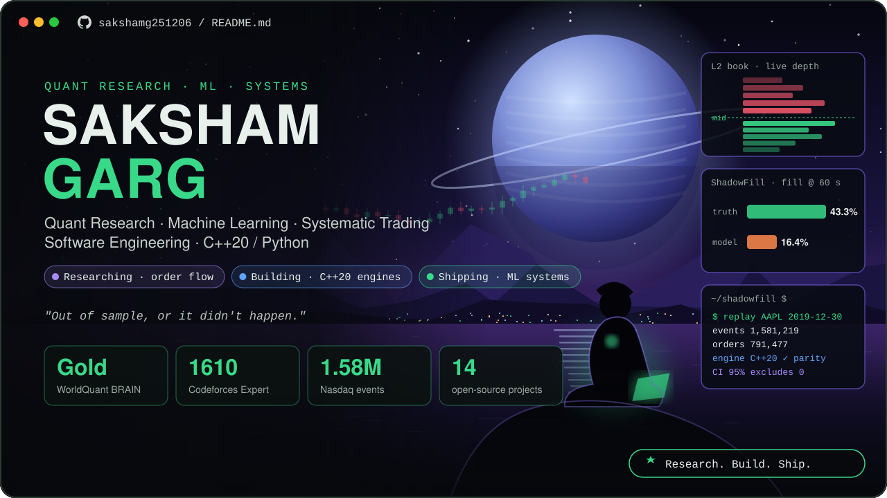
</a>

  
  
  
  
  

  I build research systems for markets and the software that runs them: <b>order-book and order-flow research</b>, 
  <b>cost-aware alpha research</b> and <b>ML models validated out of sample</b>, shipped as tested, production-style code. 
  B.Tech–M.Tech ECE @ LNMIIT Jaipur · open to quant research, quant trading and ML engineering internships

 

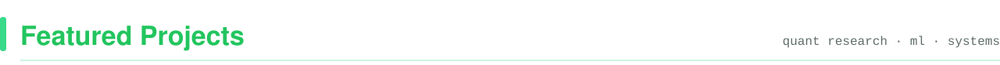

  <a href="https://github.com/sakshamg251206/shadowfill">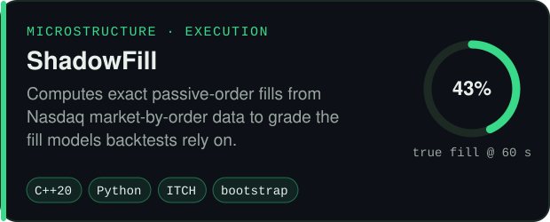</a>
  <a href="https://github.com/sakshamg251206/ofi-crypto-perps">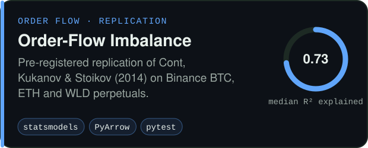</a>
  <a href="https://github.com/sakshamg251206/quant-orderbook-ml">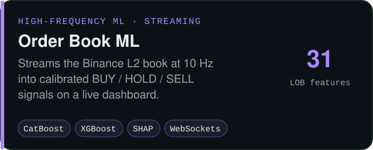</a>
  <a href="https://github.com/sakshamg251206/systematic-alpha-lab">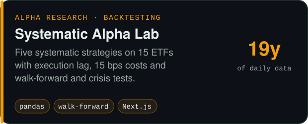</a>
  <a href="https://github.com/sakshamg251206/amazon_ml">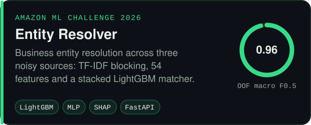</a>
  <a href="https://github.com/sakshamg251206/Adaptive_QKD">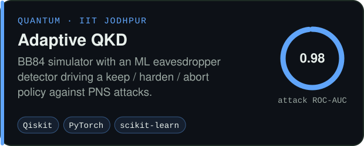</a>
  <a href="https://github.com/sakshamg251206/RagSentry">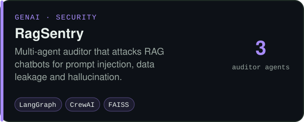</a>
  <a href="https://github.com/sakshamg251206/spamshield">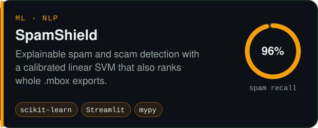</a>

  More: <a href="https://github.com/sakshamg251206/flowscope">Flowscope</a> (live order-flow terminal) ·
  <a href="https://github.com/sakshamg251206/SightEcho">SightEcho</a> (on-device vision narrator) ·
  <a href="https://github.com/sakshamg251206/DocuRAG">DocuRAG</a> (private PDF chat) ·
  <a href="https://github.com/sakshamg251206/DataRobot">Auto Data Science</a> ·
  <a href="https://github.com/sakshamg251206/webharvest">WebHarvest</a> ·
  <a href="https://github.com/sakshamg251206/Janvitta">LabhSetu</a> ·
  <a href="https://github.com/sakshamg251206/GhostDraft">GhostDraft</a>

 

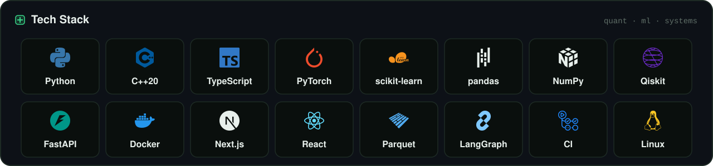

  

  

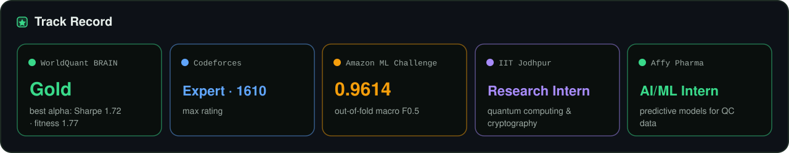

  <a href="https://drive.google.com/file/d/13neWKQFsuAHhJEAAKtW00X7jx-Gj_M9X/view?usp=drive_link">WorldQuant BRAIN proof</a> ·
  <a href="https://codeforces.com/profile/sakshamgarg87">Codeforces profile</a> ·
  <a href="https://github.com/sakshamg251206/amazon_ml">Amazon ML solution</a>

