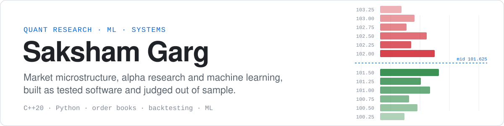

<picture>
  <source media="(prefers-color-scheme: dark)" srcset="assets/banner-dark.svg">
  
</picture>

  <a href="https://github.com/sakshamg251206/portfolio"><b>Portfolio</b></a> &nbsp;·&nbsp;
  <a href="https://github.com/sakshamg251206/portfolio/blob/main/assets/docs/Saksham_Garg_Resume.pdf"><b>Resume</b></a> &nbsp;·&nbsp;
  <a href="https://www.linkedin.com/in/saksham-garg-997560319/"><b>LinkedIn</b></a> &nbsp;·&nbsp;
  <a href="mailto:sakshamgarg87@gmail.com"><b>Email</b></a> &nbsp;·&nbsp;
  <a href="https://codeforces.com/profile/sakshamgarg87"><b>Codeforces</b></a>

I build research systems for markets and the software that runs them: order-book and order-flow studies, cost-aware alpha research, and ML models that are judged only on held-out data. I am a dual-degree (B.Tech–M.Tech) ECE student at **LNMIIT Jaipur**, a **WorldQuant BRAIN Gold**-level alpha researcher and a **Codeforces Expert**.

**How I work.** I fix hypotheses and test splits before looking at results, count trading costs as part of the signal, and report negative results as results.

> Open to **quant research**, **quant trading** and **ML engineering** internships.

## Research log

Results from my repositories, all reproducible from the code. Several hypotheses failed, and I report those as well.

| Hypothesis | Data | Result | Verdict |
| :-- | :-- | :-- | :-: |
| Backtest fill models are biased for passive orders | Nasdaq ITCH, AAPL, 791k orders | Kaplan–Meier says **16%** fill within 60 s; computed truth is **43%** | `CONFIRMED` |
| Order-flow imbalance explains same-interval price moves | Binance perps, BTC · ETH · WLD | Median R² **0.69–0.73** at 10 s | `CONFIRMED` |
| …and predicts the next interval | 6 held-out days | Out-of-sample R² **≤ 0** on every symbol; 0.07–0.14 bps per trade against a 5 bps fee | `REJECTED` |
| Simple ETF rules survive costs and strict rules | 15 ETFs, 2007–2026, 15 bps per trade | Ensemble: Sharpe **0.51**, max drawdown −22%; 3 of 5 strategies rejected | `MIXED` |
| ML can detect QKD eavesdropping that the error-rate rule misses | 10k simulated BB84 sessions | Attack ROC-AUC **0.98**; unsafe key releases under PNS attack **100% → 0%** | `CONFIRMED` |

## Quant research

<table>
<tr>
<td width="50%" valign="top">

### [ShadowFill](https://github.com/sakshamg251206/shadowfill)
`MARKET MICROSTRUCTURE` · `EXECUTION`

Measures how wrong passive-fill backtests are. It replays Nasdaq market-by-order data and computes exactly whether a limit order that was never sent would have filled, giving a ground truth to grade fill models against.

**C++20** engine held byte-identical to a Python oracle · 1.58M events · block-bootstrap intervals · pre-registered hypotheses

</td>
<td width="50%" valign="top">

### [Order-Flow Imbalance in Crypto Perps](https://github.com/sakshamg251206/ofi-crypto-perps)
`ORDER FLOW` · `REPLICATION STUDY`

A pre-registered replication of Cont, Kukanov & Stoikov (2014) on Binance USDⓈ-M perpetuals, using 31 days of native top-of-book data per symbol, plus an out-of-sample test of whether the signal is tradable after costs.

Frozen hypotheses · trial ledger · held-out days read once · no-look-ahead property test

</td>
</tr>
<tr>
<td colspan="2" align="center">

 ShadowFill, hypothesis H1: computed fill rates against the standard Kaplan–Meier backtest estimate.
</td>
</tr>
<tr>
<td width="50%" valign="top">

### [Systematic Alpha Lab](https://github.com/sakshamg251206/systematic-alpha-lab)
`ALPHA RESEARCH` · `BACKTESTING`

Five systematic strategies on 15 ETFs from 2007 to 2026, with a one-day execution lag, 15 bps costs, and walk-forward, regime and crisis tests. Each strategy gets a rule-based verdict, and the results are published on a static Next.js site.

Python · pandas · SHA-256 data provenance · Next.js

</td>
<td width="50%" valign="top">

### [Order Book ML](https://github.com/sakshamg251206/quant-orderbook-ml)
`HIGH-FREQUENCY ML` · `STREAMING`

Records the Binance L2 book 10 times a second, builds 31 microstructure features, and trains gradient-boosted and linear models to predict short-horizon price direction. Signals stream to a live dashboard as calibrated probabilities.

Book sync with gap detection · embargoed splits · train/serve parity test · CatBoost · XGBoost · SHAP

</td>
</tr>
<tr>
<td colspan="2" valign="top">

**[Flowscope](https://github.com/sakshamg251206/flowscope)**: a live order-flow terminal for Binance perpetuals. It computes order-flow imbalance (OFI) on every quote change and fits rolling ΔMid ~ OFI regressions, showing next-bucket R² next to same-bucket R², because explaining a move is not predicting it. FastAPI · WebSockets · live / sim / replay feeds

</td>
</tr>
</table>

## Machine learning & systems

| Project | What it is | Evidence |
| :-- | :-- | :-- |
| **[Entity Resolver](https://github.com/sakshamg251206/amazon_ml)** | Amazon ML Challenge 2026: business entity resolution across three noisy sources. TF-IDF blocking, 54 features, a LightGBM / ExtraTrees / MLP matcher and expected-F0.5 decoding | **0.9614** OOF macro F0.5 (rule baseline 0.595) |
| **[Adaptive QKD](https://github.com/sakshamg251206/Adaptive_QKD)** | BB84 simulator with an ML eavesdropper detector that drives a keep / harden / abort policy. Research internship, IIT Jodhpur | ROC-AUC **0.98** |
| **[RagSentry](https://github.com/sakshamg251206/RagSentry)** | Multi-agent security auditor for RAG chatbots, testing for prompt injection, data leakage and hallucination, with verdicts backed by planted canaries | LangGraph · CrewAI · FastAPI |
| **[SightEcho](https://github.com/sakshamg251206/SightEcho)** | On-device camera narrator for blind and low-vision users: Gemma runs on WebGPU in the browser and works offline | React · TypeScript · MediaPipe |
| **[DocuRAG](https://github.com/sakshamg251206/DocuRAG)** | Private chat with PDFs through a local LLM, with page-cited answers | Ollama · FAISS · FastAPI |
| **[SpamShield](https://github.com/sakshamg251206/spamshield)** | Explainable spam and scam detection with a calibrated linear SVM; also scans `.mbox` exports | Recall **96.1%** · precision **94.6%** |

Also: [Auto Data Science](https://github.com/sakshamg251206/DataRobot) (no-code ML workflow) · [WebHarvest](https://github.com/sakshamg251206/webharvest) (web page → dataset, SSRF-safe) · [LabhSetu](https://github.com/sakshamg251206/Janvitta) (government scheme eligibility engine) · [GhostDraft](https://github.com/sakshamg251206/GhostDraft) (voice → LinkedIn drafts). Each ships with tests and CI.

## Track record

| Recognition | Detail |
| :-- | :-- |
| **WorldQuant BRAIN** · Gold | Best alpha: Sharpe **1.72**, fitness **1.77**, positive Sharpe in every year 2019–2023 · [proof](https://drive.google.com/file/d/13neWKQFsuAHhJEAAKtW00X7jx-Gj_M9X/view?usp=drive_link) |
| **Codeforces** · Expert | Max rating **1610** · [profile](https://codeforces.com/profile/sakshamgarg87) |
| **Amazon ML Challenge 2026** | **0.9614** out-of-fold macro F0.5 on the competition data (a validation score, not a leaderboard rank) |
| **IIT Jodhpur** · Research Intern | Quantum computing & cryptography: ML attack detection for BB84 QKD (May–Jul 2025) |
| **Affy Pharma** · AI/ML Intern | Preprocessing pipelines and predictive models for manufacturing and QC data (May–Jul 2026) |

## Toolkit

| Area | Tools |
| :-- | :-- |
| **Quant** | alpha research · market microstructure · order-flow imbalance · transaction-cost modelling · walk-forward validation · survival analysis · block bootstrap |
| **ML** | PyTorch · scikit-learn · LightGBM · XGBoost · CatBoost · SHAP · statsmodels · RAG · LangGraph |
| **Languages** | Python · C++20 · SQL · TypeScript · JavaScript |
| **Engineering** | pandas · NumPy · Parquet · FastAPI · WebSockets · Docker · CMake · pytest · GitHub Actions · Linux |

B.Tech–M.Tech, Electronics & Communication Engineering, LNMIIT Jaipur (2024–2029). Coursework includes probability & statistics, stochastic calculus, linear algebra, optimization and numerical methods.
